# Airport Effects on U.S. County Unemployment Rates
Robby Powell  
2016-JUL-20  


# Introduction
This is my response to Ari Lamstein's R Shapefile [contest](http://www.arilamstein.com/blog/2016/07/12/announcing-r-shapefile-contest/). 

## Analysis Question
My Analysis consists of my efforts to answer the following questions:

  1. What is the effect of distance to the nearest airport on a county's unemployment rate?
  
  2. How does the traffic of the nearest airport affect unemployment rates?
  
## Analysis Plan
The Analysis plan is delineated below. 

1. Import and Clean Data.
2. Visualize each of the main data elements by year.
3. Visualize relationships between variables.
4. Visualize the airport locations on a U.S. Map with County boundaries.
5. Calculate Distances between county centroids and the nearest airport
6. Create a regression model and perform diagnostics.

## Data Sources
One of the rules of the contest is that the data are available for everyone to use. In order to meet this requirement, there are links for the data and shapefile locations below. 

  1. Airport Traffic: [Federal Aviation Administration (FAA)](http://www.faa.gov/airports/planning_capacity/passenger_allcargo_stats/passenger/)

  2. Airport Locations: [openflights.org](http://openflights.org/data.html)
  
  3. County Shapefile: [US Census Bureau](https://www.census.gov/geo/maps-data/data/tiger-line.html)
  
  4. Unemployment data: [Bureau of Labor Statistics (BLS)](http://download.bls.gov/pub/time.series/la/)
  
Where feasible, I have also included a series of scripts that may be used to download the exact files that I used for the analysis. These are located in the Appendicies along with the full analysis script for ease of implementation/testing by other analysts.
  
If it is not listed in this section, then it will be listed as either an R package, or it will be something that I create during the analysis and write-up processes.

# Setup
First, we need to set up our script for the analysis. In this case, we are setting up the main directory structure and the packages required for the analysis.

## Directory setup

In my case, I prefer to start the document off with setting up my main directories in variables. This allows me to use the `paste` and `paste0` functions in base R in order to ease the transfer of the scripts to other directories. 

If you change directories, then all you need to do is to alter the `main.dir` variable, and everything else will follow. This reduces the need for changing the directory in multiple locations throughout an analysis.


```r
# Main directory
main.dir <- "~/spatial-analysis-in-r/"

# Script directory
script.dir <- paste0(main.dir, "scripts/")

# data directory
dat.dir <- paste0(main.dir, "data/")
```

## Package setup

The packages utilized in this analysis are below. Unless otherwise noted, they are available from CRAN.

The comments after the packages explain why I am using them.


```r
# data import
library(openxlsx)

# data cleaning
library(dplyr)
library(magrittr)
library(stringr)

# general plotting
library(ggplot2)

# mapping
library(sp)
library(rgdal)
library(GISTools)

# distance calculation
library(geosphere)
```

# Data Import and Cleaning
In this section, I will import and clean the data.

## BLS Data
First, I will import the main data set, which is labeled `la.data.64.County`. This contains all of the unemployment numbers.


```r
# Import UE Data
fname <- paste0(dat.dir, "/bls/la.data.64.County")
bls.dat <- read.delim(fname, header = TRUE, stringsAsFactors = FALSE, 
                      sep = "\t")

# trim white space in series_id
bls.dat$series_id <- trimws(bls.dat$series_id)

# change value to numeric
bls.dat$value <- as.numeric(bls.dat$value)
```

```
## Warning: NAs introduced by coercion
```

```r
head(bls.dat)
```

```
##              series_id year period value footnote_codes
## 1 LAUCN010010000000003 1990    M01   6.4               
## 2 LAUCN010010000000003 1990    M02   6.6               
## 3 LAUCN010010000000003 1990    M03   5.8               
## 4 LAUCN010010000000003 1990    M04   6.6               
## 5 LAUCN010010000000003 1990    M05   6.0               
## 6 LAUCN010010000000003 1990    M06   7.0
```

Upon examination, the missing values are for the years 2005 and 2006, which means that they are not of interest to this analysis.

After getting the basic preparation for the main dataset, it is time to import the crosswalks for easier identification.


```r
# Import la.measure
fname <- paste0(dat.dir, "/bls/la.measure")
bls.measure <- read.delim(fname, header = TRUE, stringsAsFactors = FALSE, 
                      sep = "\t")
```

After looking at this data, the variables are mis-labeled. These will be fixed below.


```r
# fix variables
bls.measure$measure_text <- bls.measure$measure_code
bls.measure$measure_code <- as.numeric(rownames(bls.measure))

bls.measure
```

```
##    measure_code      measure_text
## 03            3 unemployment rate
## 04            4      unemployment
## 05            5        employment
## 06            6       labor force
```

Import and examine the period definitions.


```r
# la.period
fname <- paste0(dat.dir, "/bls/la.period")
bls.period <- read.delim(fname, header = TRUE, stringsAsFactors = FALSE, 
                      sep = "\t")

bls.period
```

```
##    period period_abbr    period_name
## 1     M01         JAN        January
## 2     M02         FEB       February
## 3     M03         MAR          March
## 4     M04         APR          April
## 5     M05         MAY            May
## 6     M06         JUN           June
## 7     M07         JUL           July
## 8     M08         AUG         August
## 9     M09         SEP      September
## 10    M10         OCT        October
## 11    M11         NOV       November
## 12    M12         DEC       December
## 13    M13       AN AV Annual Average
```

Import series definitions, which contains the names of the counties.


```r
# la.period
fname <- paste0(dat.dir, "/bls/la.series")
bls.series <- read.table(fname, header = TRUE, stringsAsFactors = FALSE, 
                      sep = "\t")

# trim white space from series_id
bls.series$series_id <- trimws(bls.series$series_id)

head(bls.series)
```

```
##              series_id area_type_code       area_code measure_code
## 1 LASBS060000000000003              L BS0600000000000            3
## 2 LASBS060000000000004              L BS0600000000000            4
## 3 LASBS060000000000005              L BS0600000000000            5
## 4 LASBS060000000000006              L BS0600000000000            6
## 5 LASBS120000000000003              L BS1200000000000            3
## 6 LASBS120000000000004              L BS1200000000000            4
##   seasonal srd_code
## 1        S        6
## 2        S        6
## 3        S        6
## 4        S        6
## 5        S       12
## 6        S       12
##                                                                                  series_title
## 1 Unemployment Rate: Balance of California, state less Los Angeles-Long Beach-Glendale MD (S)
## 2      Unemployment: Balance of California, state less Los Angeles-Long Beach-Glendale MD (S)
## 3        Employment: Balance of California, state less Los Angeles-Long Beach-Glendale MD (S)
## 4       Labor Force: Balance of California, state less Los Angeles-Long Beach-Glendale MD (S)
## 5          Unemployment Rate: Balance of Florida, state less Miami-Miami Beach-Kendall MD (S)
## 6               Unemployment: Balance of Florida, state less Miami-Miami Beach-Kendall MD (S)
##   footnote_codes begin_year begin_period end_year end_period
## 1                      1976          M01     2016        M05
## 2                      1976          M01     2016        M05
## 3                      1976          M01     2016        M05
## 4                      1976          M01     2016        M05
## 5                      1990          M01     2016        M05
## 6                      1990          M01     2016        M05
```

Now that all of the necessary data elements are imported, it's time to do some cleaning on the BLS dataset. 

In this case, the data needs to be joined with the proper identifiers, and then the dataset will need to be reduced.

Because we are interested in the annual averages, we will filter for period `M13`. In addition, we will filter for the years 2011-2015. After we have joined the data, we will select only required variables.


```r
# filter for period M13
bls.dat <- bls.dat[bls.dat$period == "M13",]

# filter for year
bls.dat <- bls.dat[bls.dat$year %in% c(2011:2015),]
 
# Join data together via a left join.
bls.dat <- merge(bls.dat, bls.series,
                 by.x = "series_id", by.y = "series_id",
                 all.x = TRUE)

bls.dat <- merge(bls.dat, bls.measure,
                 by.x = "measure_code", by.y = "measure_code", all.x = TRUE)

# filter for unemployment rate
bls.dat <- bls.dat[bls.dat$measure_text == "unemployment rate", ]

# reduce dataset
bls.dat <- bls.dat[, c("series_id", "year", "value", 
                       "series_title", "measure_text")]

# Create county name and state variables for easier identification
str.pattern <- "[A-za-z.//]*\\s*[A-za-z.//]*\\s*[A-Za-z.//]*,"

bls.dat$county <- str_extract(bls.dat$series_title, str.pattern)

bls.dat$county <- trimws(gsub(",", "", bls.dat$county))

bls.dat$state <-  str_extract(bls.dat$series_title, "[A-Z]{2}")

# Extract FIPS Code
bls.dat$FIPS <- substr(bls.dat$series_id, 6, 10)

# Select columns
bls <- bls.dat[c("FIPS", "county", "state", "year", "value")]

# Change names
names(bls) <- c("FIPS", "county", "state", "year", "UE")
```

Here is the final BLS dataset.


```r
head(bls)
```

```
##    FIPS            county state year   UE
## 1 37161 Rutherford County    NC 2011 14.6
## 2 01001    Autauga County    AL 2013  6.2
## 3 47069   Hardeman County    TN 2011 12.1
## 4 01113    Russell County    AL 2014  6.6
## 5 21095     Harlan County    KY 2013 18.2
## 6 01005    Barbour County    AL 2011 11.5
```

```r
summary(bls)
```

```
##      FIPS              county             state                year     
##  Length:16135       Length:16135       Length:16135       Min.   :2011  
##  Class :character   Class :character   Class :character   1st Qu.:2012  
##  Mode  :character   Mode  :character   Mode  :character   Median :2013  
##                                                           Mean   :2013  
##                                                           3rd Qu.:2014  
##                                                           Max.   :2015  
##                                                           NA's   :40    
##        UE        
##  Min.   : 1.100  
##  1st Qu.: 5.100  
##  Median : 6.900  
##  Mean   : 7.386  
##  3rd Qu.: 9.000  
##  Max.   :28.900  
##  NA's   :40
```


## Airport Data
Here, we import and check the airport dataset. This dataset is really clean, so it will be utilized as-is.


```r
fname <- paste0(dat.dir, "airports/airports.dat.txt")
airports <- read.csv(fname, header = TRUE, stringsAsFactors = FALSE)

summary(airports)
```

```
##    airport.id       name               city             country         
##  Min.   :   1   Length:8107        Length:8107        Length:8107       
##  1st Qu.:2092   Class :character   Class :character   Class :character  
##  Median :4257   Mode  :character   Mode  :character   Mode  :character  
##  Mean   :4766                                                           
##  3rd Qu.:7508                                                           
##  Max.   :9541                                                           
##  iata.faa.code       icao.code            latitude      
##  Length:8107        Length:8107        Min.   :-90.000  
##  Class :character   Class :character   1st Qu.:  8.825  
##  Mode  :character   Mode  :character   Median : 34.988  
##                                        Mean   : 26.818  
##                                        3rd Qu.: 47.958  
##                                        Max.   : 82.518  
##    longitude           altitude         UTC.offset      
##  Min.   :-179.877   Min.   :-1266.0   Min.   :-12.0000  
##  1st Qu.: -79.022   1st Qu.:   38.0   1st Qu.: -5.0000  
##  Median :   5.292   Median :  272.0   Median :  1.0000  
##  Mean   :  -3.922   Mean   :  933.4   Mean   :  0.1692  
##  3rd Qu.:  49.786   3rd Qu.: 1020.0   3rd Qu.:  4.0000  
##  Max.   : 179.951   Max.   :14472.0   Max.   : 13.0000  
##      DST            time.zone.olson   
##  Length:8107        Length:8107       
##  Class :character   Class :character  
##  Mode  :character   Mode  :character  
##                                       
##                                       
## 
```

```r
head(airports)
```

```
##   airport.id                       name         city          country
## 1          1                     Goroka       Goroka Papua New Guinea
## 2          2                     Madang       Madang Papua New Guinea
## 3          3                Mount Hagen  Mount Hagen Papua New Guinea
## 4          4                     Nadzab       Nadzab Papua New Guinea
## 5          5 Port Moresby Jacksons Intl Port Moresby Papua New Guinea
## 6          6                 Wewak Intl        Wewak Papua New Guinea
##   iata.faa.code icao.code  latitude longitude altitude UTC.offset DST
## 1           GKA      AYGA -6.081689  145.3919     5282         10   U
## 2           MAG      AYMD -5.207083  145.7887       20         10   U
## 3           HGU      AYMH -5.826789  144.2959     5388         10   U
## 4           LAE      AYNZ -6.569828  146.7262      239         10   U
## 5           POM      AYPY -9.443383  147.2200      146         10   U
## 6           WWK      AYWK -3.583828  143.6692       19         10   U
##        time.zone.olson
## 1 Pacific/Port_Moresby
## 2 Pacific/Port_Moresby
## 3 Pacific/Port_Moresby
## 4 Pacific/Port_Moresby
## 5 Pacific/Port_Moresby
## 6 Pacific/Port_Moresby
```

## FAA Airport Traffic Data
The FAA Airport Data consists of four Excel spreadsheets. These will be imported and combined before they are cleaned.


```r
fname <- paste0(dat.dir, "faa/CY12AllEnplanements.xlsx")
faa.cy12 <- openxlsx::read.xlsx(fname)

fname <- paste0(dat.dir, "faa/cy13-all-enplanements.xlsx")
faa.cy13 <- openxlsx::read.xlsx(fname)

fname <- paste0(dat.dir, "faa/CY14-all-enplanements.xlsx")
faa.cy14 <- openxlsx::read.xlsx(fname, sheet = "data")

fname <- paste0(dat.dir, "faa/preliminary-cy15-all-enplanements.xlsx")
faa.cy15 <- openxlsx::read.xlsx(fname)

# Select Annual Data, Rename columns, and add year.
faa.cy11 <- faa.cy12[, c("ST", "Locid", "City", "Airport.Name", 
                         "CY.11.Enplanements")]
names(faa.cy11) <- c("state", "id", "city", "airport.name", "enplanements")
faa.cy11$year <- 2011

faa.cy12 <- faa.cy12[, c("ST", "Locid", "City", "Airport.Name", 
                         "CY.12.Enplanements")]
names(faa.cy12) <- c("state", "id", "city", "airport.name", "enplanements")
faa.cy12$year <- 2012

faa.cy13 <- faa.cy13[, c("ST", "Locid", "City", "Airport.Name",
                         "CY.13.Enplanements")]
names(faa.cy13) <- c("state", "id", "city", "airport.name", "enplanements")
faa.cy13$year <- 2013

faa.cy14 <- faa.cy14[, c("ST", "Locid", "City", "Airport.Name",
                         "CY.14.Enplanements")]
names(faa.cy14) <- c("state", "id", "city", "airport.name", "enplanements")
faa.cy14$year <- 2014

faa.cy15 <- faa.cy15[, c("ST", "Locid", "City", "Airport.Name",
                         "CY.15.Enplanements")]
names(faa.cy15) <- c("state", "id", "city", "airport.name", "enplanements")
faa.cy15$year <- 2015

# Combine
faa <- rbind(faa.cy11, faa.cy12, faa.cy13, faa.cy14, faa.cy15)

summary(faa)
```

```
##     state                id                city          
##  Length:8433        Length:8433        Length:8433       
##  Class :character   Class :character   Class :character  
##  Mode  :character   Mode  :character   Mode  :character  
##                                                          
##                                                          
##                                                          
##                                                          
##  airport.name        enplanements           year     
##  Length:8433        Min.   :       0   Min.   :2011  
##  Class :character   1st Qu.:       8   1st Qu.:2012  
##  Mode  :character   Median :     156   Median :2013  
##                     Mean   :  446406   Mean   :2013  
##                     3rd Qu.:    8240   3rd Qu.:2014  
##                     Max.   :49340732   Max.   :2015  
##                     NA's   :7
```

```r
head(faa)
```

```
##   state  id      city                        airport.name enplanements
## 1    AK ANC Anchorage Ted Stevens Anchorage International      2354987
## 2    AK FAI Fairbanks             Fairbanks International       438188
## 3    AK JNU    Juneau                Juneau International       355499
## 4    AK BET    Bethel                              Bethel       152366
## 5    AK KTN Ketchikan             Ketchikan International       102086
## 6    AK ENA     Kenai                     Kenai Municipal        90806
##   year
## 1 2011
## 2 2011
## 3 2011
## 4 2011
## 5 2011
## 6 2011
```


## Shapefile Import
This first snippet of code shows how to import the Census Shapefile.


```r
dsn <- "/Users/Robby/spatial-analysis-in-r/data/census/"
layer <- "tl_2015_us_county"
county <- rgdal::readOGR(dsn = dsn, layer = layer)
```

```
## OGR data source with driver: ESRI Shapefile 
## Source: "/Users/Robby/spatial-analysis-in-r/data/census/", layer: "tl_2015_us_county"
## with 3233 features
## It has 17 fields
```

Because the United States has such a large spread of territory and protectorates around the world, it is necessary to set limits for the maps. In this case, we will be using maps for the Continental U.S. (CONUS), Alaska, and Hawaii. The limits chosen for this exercise are listed below.


```r
# Continental US (CONUS)
conus.min.lat <- 25
conus.max.lat <- 50
conus.min.long <- -126
conus.max.long <- -65

conus.long.limits <- c(conus.min.long, conus.max.long)
conus.lat.limits <- c(conus.min.lat, conus.max.lat)
```


```r
# Hawaii
hawaii.min.lat <- 18
hawaii.max.lat <- 23
hawaii.min.long <- -161 
hawaii.max.long <- -154

hawaii.long.limits <- c(hawaii.min.long, hawaii.max.long)
hawaii.lat.limits <- c(hawaii.min.lat, hawaii.max.lat)
```


```r
# Alaska
alaska.min.lat <- 52
alaska.max.lat <- 72
alaska.min.long <- -177
alaska.max.long <- -129

alaska.long.limits <- c(alaska.min.long, alaska.max.long)
alaska.lat.limits <- c(alaska.min.lat, alaska.max.lat)
```

## Identify Counties associated with Airports
Now that we have all of the data available, it is time to identify the relationship between the airports and counties. In this effort, I will first overlay the airports over the counties, and then determine which county contains the airports.

An output dataset will be produced, which can then be combined with all of the data to produce the final dataset.

First, in order to get an idea of what things look like, we will need to plot the airports and the counties on the same map. In order to reduce the number of images, I will put the maps together in a single image.


```r
# filter airport coordinates based on FAA codes in faa.data
airports <- airports[airports$country == "United States",]

#filter for CONUS, AK, and HI airports for plotting purposes-only
airports2 <- 
  airports[(between(airports$latitude, conus.min.lat, conus.max.lat) &
           between(airports$longitude, conus.min.long, conus.max.long)) |
           (between(airports$latitude, hawaii.min.lat, hawaii.max.lat) &
           between(airports$longitude, hawaii.min.long, hawaii.max.long)) |
           (between(airports$latitude, alaska.min.lat, alaska.max.lat) &
           between(airports$longitude, alaska.min.long, alaska.max.long)),]

# Prep airport coordinates
coordinates(airports) <- c("longitude", "latitude")
proj4string(airports) <- proj4string(county)

coordinates(airports2) <- c("longitude", "latitude")
proj4string(airports2) <- proj4string(county)

# Set layout for image.
layout(matrix(c(1,1,1,1,
                1,1,1,1,
                2,2,3,3,
                2,2,3,3), ncol = 4, nrow = 4, byrow = TRUE),
       respect = TRUE)

# CONUS Plot (Plot 1)
plot(county, xlim = conus.long.limits, ylim = conus.lat.limits,
     main = "Plot of Airports and Counties", border = "grey",
     lwd = 0.25)
points(airports2, xlim = conus.long.limits, ylim = conus.lat.limits,
       pch = 20, cex = 0.5)

# Hawaii Plot (Plot 2)
plot(county, xlim = hawaii.long.limits, ylim = hawaii.lat.limits,
     border = "grey", lwd = 0.25)
points(airports2, xlim = hawaii.long.limits, ylim = hawaii.lat.limits,
       pch = 20)

# Alaska Plot (Plot 3)
plot(county, xlim = alaska.long.limits, ylim = alaska.lat.limits,
     border = "grey", lwd = 0.25)
points(airports2, xlim = alaska.long.limits, ylim = alaska.lat.limits,
       pch = 20)
```

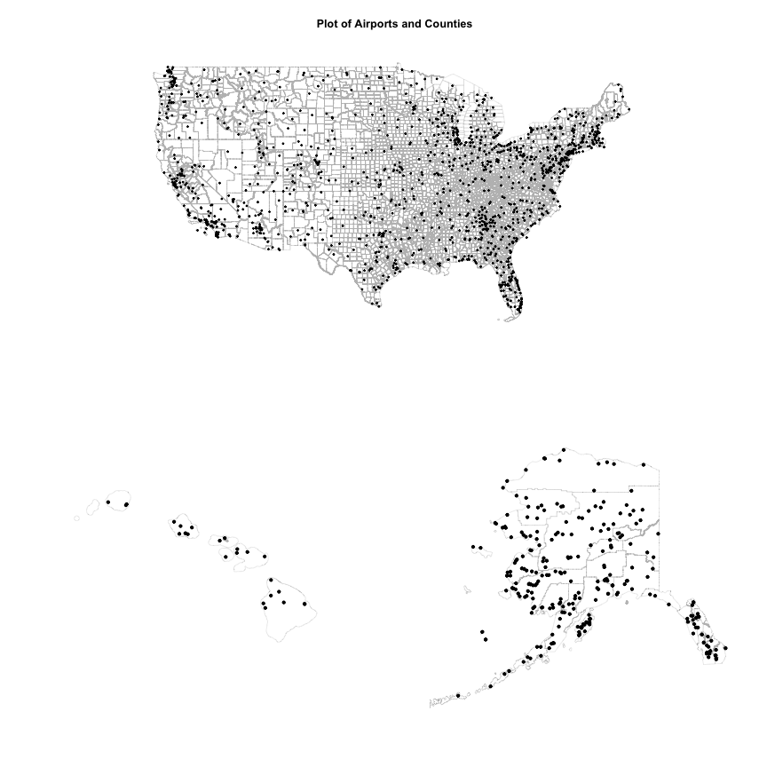<!-- -->

This snippet of code will determine which the county within which each airport resides. 


```r
# get county ID
airports$county.id <- 
  sp::over(airports, county)$GEOID

# look at results
head(airports)
```

```
##                coordinates airport.id                            name
## 319  (-86.81381, 39.63356)       6891           Putnam County Airport
## 1105 (-86.12801, 41.99293)       6890      Dowagiac Municipal Airport
## 1122 (-81.57758, 39.97503)       6889     Cambridge Municipal Airport
## 1471 (-87.42156, 44.84367)       6885  Door County Cherryland Airport
## 1508 (-76.64719, 39.79482)       6884    Shoestring Aviation Airfield
## 1618   (-118.8414, 45.695)       6883 Eastern Oregon Regional Airport
##              city       country iata.faa.code icao.code altitude
## 319   Greencastle United States           4I7       \\N      842
## 1105     Dowagiac United States           C91       \\N      748
## 1122    Cambridge United States           CDI       \\N      799
## 1471 Sturgeon Bay United States           SUE       \\N      725
## 1508 Stewartstown United States           0P2       \\N     1000
## 1618    Pendleton United States           PDT      KPDT     1497
##      UTC.offset DST     time.zone.olson county.id
## 319          -5   U    America/New_York     18133
## 1105         -5   U    America/New_York     26027
## 1122         -5   U    America/New_York     39059
## 1471         -6   U     America/Chicago     55029
## 1508         -5   U    America/New_York     42133
## 1618         -8   A America/Los_Angeles     41059
```

## Calculate County Distance to the Nearest Airport
Now, it is time to calculate the distance of the county centroids to their nearest airport. In order to determine this quantity, we will utilize the Great Circle Formula, or, more specifically, the Haversine Formula to calculate the distances.

Thankfully, we do not have to create this formula from scratch. It is located in the `geosphere` package, which is available on CRAN. The results will be in meters. 

Due to the way the output is being used, there is no need to change units; however, because distance is easier for most to understand in miles, we will convert the resulting distances to miles after we have determined the minimum distance for the airports.


```r
# Set up output data frame
apt.dist.dat <- data.frame(county.id = county$GEOID,
                           stringsAsFactors = F)

# Calculate distance between each airport
# NOTE: Consider building function instead of looping.
for (apt in airports$airport.id) {
  # The id is created such that the numbers will not make R think it is
  # creating column number XXX vice just adding a new column.
  apt.id <- paste0("airport.", apt)
  
  # get coordinates for airports and counties
  apt.coords <- coordinates(airports)[airports$airport.id == apt,]
  county.coords <- coordinates(county)
  
  # calculate distance
  apt.dist.dat[, apt.id] <- distHaversine(apt.coords, county.coords)
}
```

Now that we have the distances calculated, we have to determine which airport is the closest.

To make things easier and faster, a function will be created to calculate the minimum distance for a set of columns (the airports). Then the `apply` function will be utilized in lieu of a loop to increase computational efficiency.


```r
# This function will return the minimum distance.
min.dist.fn <- function(temp) {

  # Select airport with smallest distance
  min.index <- which.min(temp)
  
  # Return distance
  min.dist <- temp[min.index]
  
  # Get airport ID
  apt.id <- names(temp)[min.index]
  
  # output data
  out <- cbind(min.dist, apt.id)
  return(out)
}

# Get counties
counties <- apt.dist.dat$county.id
# Get minimum distance
min.dist <- apply(apt.dist.dat[,-1], MARGIN = 1, FUN = min.dist.fn)

# transpose and convert from list
min.dist <- t(unlist(min.dist))

# create data frame
min.dist <- data.frame(min.dist, stringsAsFactors = F)

# give column names
names(min.dist) <- c("min.distance", "airport.id")

# convert min.dist to miles
min.dist$min.distance <- as.numeric(min.dist$min.distance)/1609.34

# Get airport ID number
min.dist$airport.id <- gsub("airport.", "", min.dist$airport.id)

# create final distance data set.
cnty.dist <- cbind(counties, min.dist)

cnty.dist$counties <- as.character(cnty.dist$counties)
# look at resulting data set
summary(cnty.dist)
```

```
##    counties          min.distance        airport.id       
##  Length:3233        Min.   :   0.3427   Length:3233       
##  Class :character   1st Qu.:  13.1687   Class :character  
##  Mode  :character   Median :  24.0599   Mode  :character  
##                     Mean   :  57.7936                     
##                     3rd Qu.:  37.0735                     
##                     Max.   :2556.3075
```

```r
head(cnty.dist)
```

```
##   counties min.distance airport.id
## 1    31039    39.472667       3753
## 2    53069    23.228418       7085
## 3    35011    62.292263       3834
## 4    31109     5.946045       3543
## 5    31129    56.432641       5740
## 6    72085  1047.847616       7889
```

To get a good visual of the data, here is the choropleth plot of the distance to the airport for the Fifty States.


```r
# Set layout for image.
layout(matrix(c(1,1,1,1,
                1,1,1,1,
                2,2,3,3,
                2,2,3,3), ncol = 4, nrow = 4, byrow = TRUE),
       respect = TRUE)

# create plot dat
plt.dat <- cnty.dist[order(cnty.dist$counties),]

# Create shading
shading <- GISTools::auto.shading(plt.dat$min.distance, n = 5, cols = brewer.pal(5, "Blues"))

# CONUS Plot (Plot 1)
choropleth(county, plt.dat$min.distance, shading = shading,
           xlim = conus.long.limits, ylim = conus.lat.limits,
           main = "Plot of Min Distance to Airport", border = NA)
# add legend
choro.legend(px = -125, py = 31, sh = shading)

# Hawaii Plot (Plot 2)
choropleth(county, plt.dat$min.distance, shading = shading,
     xlim = hawaii.long.limits, ylim = hawaii.lat.limits,
     border = NA)

# Alaska Plot (Plot 3)
choropleth(county, plt.dat$min.distance, shading = shading,
     xlim = alaska.long.limits, ylim = alaska.lat.limits,
     border = NA)
```

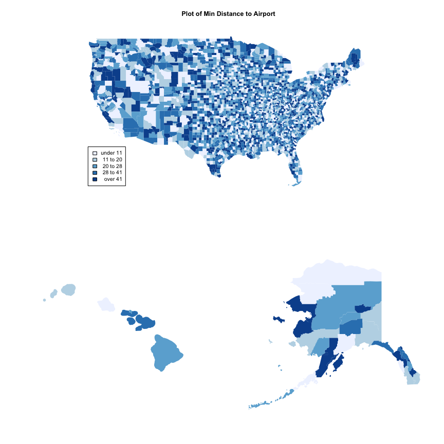<!-- -->

## Create Final Data Set
Now that the data have been calculated and cleaned, it is time to put together the final analysis set.

Since the BLS data likely has most, if not all, counties available, we will start with that dataset. Then we will join with the distance to the nearest airport, airport ID, and then the current-year traffic at that airport. 

Where possible, the data will be joined by both county FIPS and year. Otherwise, the same values will be assumed for each year.


```r
# join BLS data and cnty.dist dat
analysis.dat <- merge(bls, cnty.dist,
                      by.x = "FIPS", by.y = "counties", 
                      all.x = TRUE)

# join airports with analysis.dat
analysis.dat <- merge(analysis.dat, 
                      airports[, c("airport.id", "iata.faa.code", "county.id")],
                      by.x = "airport.id", by.y = "airport.id", all.x = TRUE)

# join with faa data
analysis.dat <- merge(analysis.dat, faa[, c("id", "year", "enplanements")],
                      by.x = c("iata.faa.code", "year"),
                      by.y = c("id", "year"), all.x = TRUE)

# determine if airport located within county
analysis.dat$airport.in.cnty <- 
    ifelse(analysis.dat$FIPS == analysis.dat$county.id, 1, 0)


# select and reorder remaining variables
vars <- c("FIPS", "county", "state", "year", "UE", "min.distance", 
          "enplanements", "airport.in.cnty")

analysis.dat <- analysis.dat[, vars]

# look at data
dim(analysis.dat)
```

```
## [1] 16135     8
```

```r
summary(analysis.dat)
```

```
##      FIPS              county             state                year     
##  Length:16135       Length:16135       Length:16135       Min.   :2011  
##  Class :character   Class :character   Class :character   1st Qu.:2012  
##  Mode  :character   Mode  :character   Mode  :character   Median :2013  
##                                                           Mean   :2013  
##                                                           3rd Qu.:2014  
##                                                           Max.   :2015  
##                                                           NA's   :40    
##        UE          min.distance        enplanements      airport.in.cnty 
##  Min.   : 1.100   Min.   :   0.3427   Min.   :       0   Min.   :0.0000  
##  1st Qu.: 5.100   1st Qu.:  13.1306   1st Qu.:     168   1st Qu.:0.0000  
##  Median : 6.900   Median :  23.9636   Median :    6624   Median :0.0000  
##  Mean   : 7.386   Mean   :  49.8523   Mean   :  327022   Mean   :0.2765  
##  3rd Qu.: 9.000   3rd Qu.:  36.8046   3rd Qu.:   94044   3rd Qu.:1.0000  
##  Max.   :28.900   Max.   :1075.4897   Max.   :49340732   Max.   :1.0000  
##  NA's   :40       NA's   :40          NA's   :5391       NA's   :40
```

```r
head(analysis.dat)
```

```
##    FIPS          county state year   UE min.distance enplanements
## 1 13151    Henry County    GA 2011 10.3     6.073055           NA
## 2 41055  Sherman County    OR 2011 11.1    22.023565           NA
## 3 40135 Sequoyah County    OK 2011  9.2    17.663786           NA
## 4 55119   Taylor County    WI 2011  8.5    34.464787           NA
## 5 55107     Rusk County    WI 2011 11.0    38.750674           NA
## 6 55113   Sawyer County    WI 2011 11.1    37.759840           NA
##   airport.in.cnty
## 1               1
## 2               0
## 3               0
## 4               0
## 5               0
## 6               0
```

```r
# show complete cases
dim(analysis.dat[complete.cases(analysis.dat),])
```

```
## [1] 10744     8
```

```r
summary(analysis.dat[complete.cases(analysis.dat),])
```

```
##      FIPS              county             state                year     
##  Length:10744       Length:10744       Length:10744       Min.   :2011  
##  Class :character   Class :character   Class :character   1st Qu.:2012  
##  Mode  :character   Mode  :character   Mode  :character   Median :2013  
##                                                           Mean   :2013  
##                                                           3rd Qu.:2014  
##                                                           Max.   :2015  
##        UE          min.distance       enplanements      airport.in.cnty 
##  Min.   : 1.100   Min.   :  0.5124   Min.   :       0   Min.   :0.0000  
##  1st Qu.: 4.900   1st Qu.: 14.4260   1st Qu.:     168   1st Qu.:0.0000  
##  Median : 6.600   Median : 25.3990   Median :    6624   Median :0.0000  
##  Mean   : 6.973   Mean   : 27.4982   Mean   :  327022   Mean   :0.2543  
##  3rd Qu.: 8.600   3rd Qu.: 37.6483   3rd Qu.:   94044   3rd Qu.:1.0000  
##  Max.   :28.900   Max.   :127.4185   Max.   :49340732   Max.   :1.0000
```

```r
head(analysis.dat[complete.cases(analysis.dat),])
```

```
##       FIPS            county state year   UE min.distance enplanements
## 1062 01087      Macon County    AL 2013  9.7     5.212564            2
## 1063 01123 Tallapoosa County    AL 2013  8.1    28.624586            2
## 1064 01011    Bullock County    AL 2013  9.4    24.989976            2
## 1109 47171     Unicoi County    TN 2013 10.5    23.085239           55
## 1110 37199     Yancey County    NC 2013  9.5    33.520322           55
## 1111 37189    Watauga County    NC 2013  6.4    28.304496           55
##      airport.in.cnty
## 1062               1
## 1063               0
## 1064               0
## 1109               0
## 1110               0
## 1111               0
```

# Exploratory Analysis

## Basic Data Visualization
In the first step, we need to visualize the data.

We will start by looking at Unemployment boxplots.

```r
# Unemployment Data
ggplot(analysis.dat[!is.na(analysis.dat$year),]) +
  aes(year, UE, group = year) +
  geom_boxplot() +
  xlab("Year") + ylab("Unemployment") +
  ggtitle("Unemployment by Year")
```

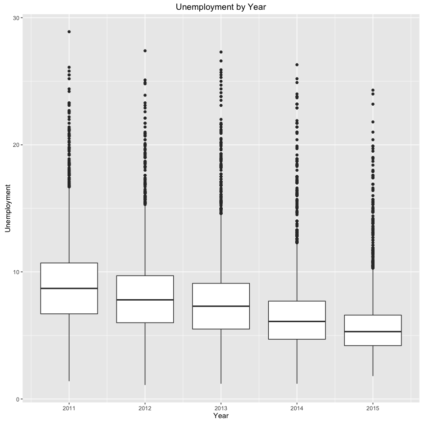<!-- -->

Now we will look at enplanements. 


```r
ggplot(analysis.dat) +
  aes(year, enplanements, group = year) +
  geom_boxplot() +
  xlab("Year") + ylab("Enplanements") +
  ggtitle("Enplanements by Year")
```

```
## Warning: Removed 5391 rows containing non-finite values (stat_boxplot).
```

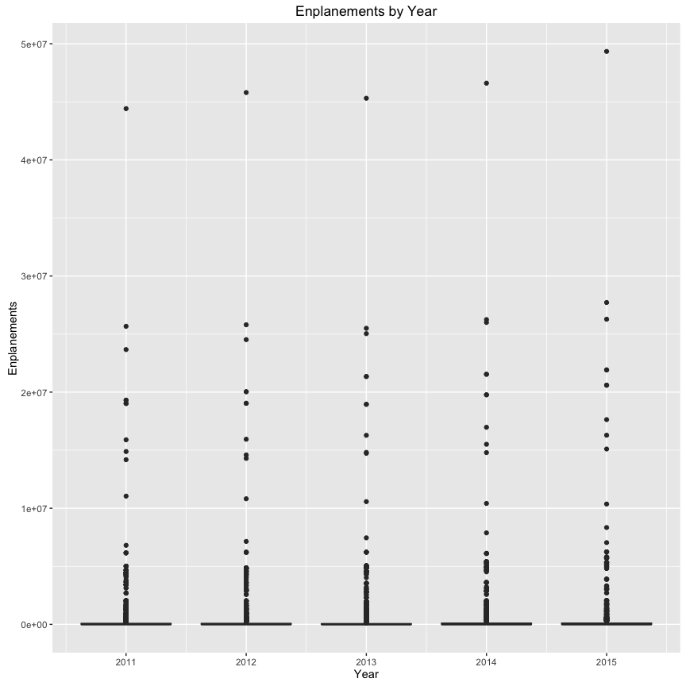<!-- -->

Because there is such a variation, we will look at the boxplot where the enplanements are less than 250,000. There are 0.83293 that meet this category. 


```r
ggplot(analysis.dat[analysis.dat$enplanements < 250000,]) +
  aes(year, enplanements, group = year) +
  geom_boxplot() +
  xlab("Year") + ylab("Enplanements") +
  ggtitle("Enplanements by Year")
```

```
## Warning: Removed 5391 rows containing non-finite values (stat_boxplot).
```

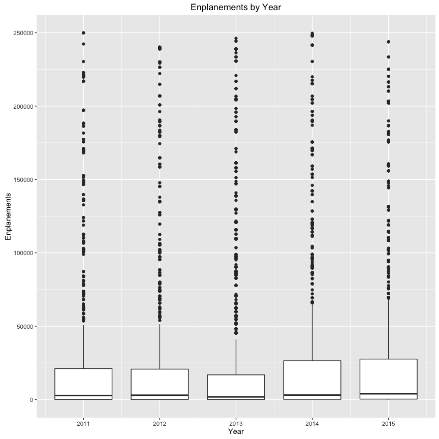<!-- -->

Now we will look at the distance to the airport.


```r
ggplot(analysis.dat) +
  aes(year, min.distance, group = year) +
  geom_boxplot() +
  xlab("Year") + ylab("Minimum Distance (mi)") +
  ggtitle("Minimum Distance to Nearest Airport by Year")
```

```
## Warning: Removed 40 rows containing non-finite values (stat_boxplot).
```

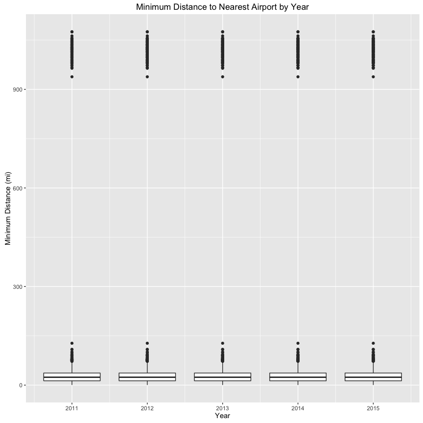<!-- -->

```r
ggplot(analysis.dat[analysis.dat$min.distance < 900,]) +
  aes(year, min.distance, group = year) +
  geom_boxplot() +
  xlab("Year") + ylab("Minimum Distance (mi)") +
  ggtitle("Minimum Distance to Nearest Airport by Year")
```

```
## Warning: Removed 40 rows containing non-finite values (stat_boxplot).
```

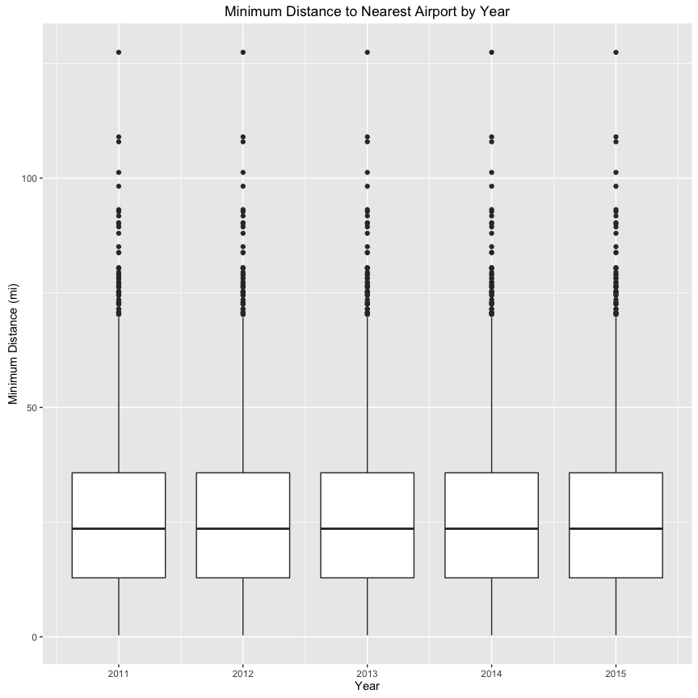<!-- -->

```r
hist(analysis.dat$min.distance, 
     main = "Histogram of Minimum Distance")
```

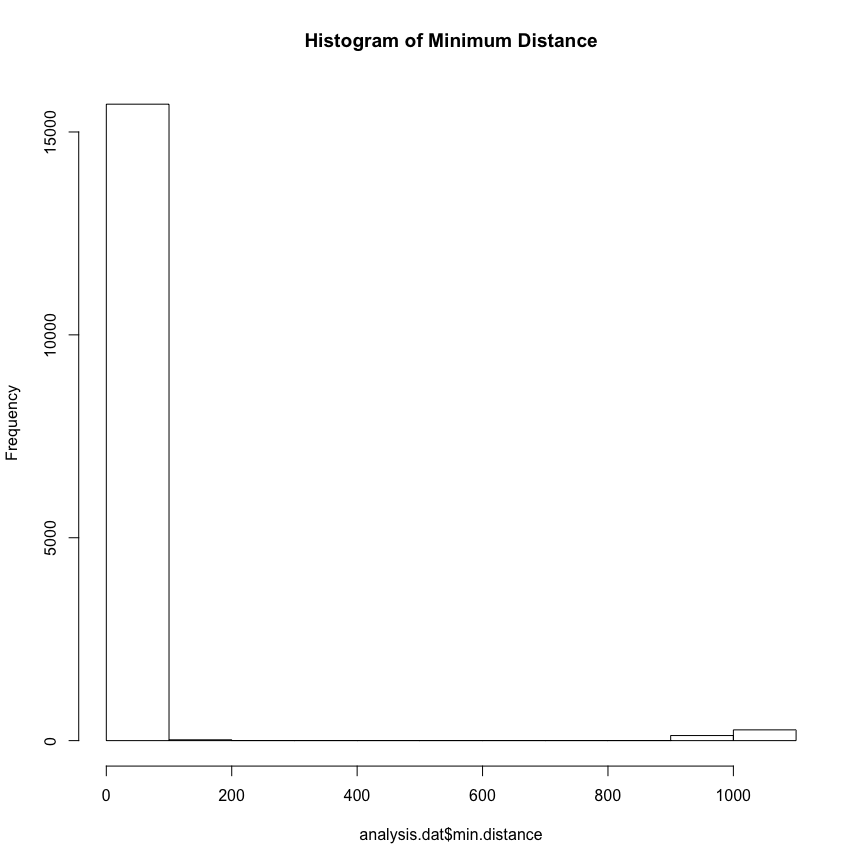<!-- -->

```r
hist(analysis.dat$min.distance[analysis.dat$min.distance < 900],
     main = "Histogram of Minimum Distance to Airport < 900mi")
```

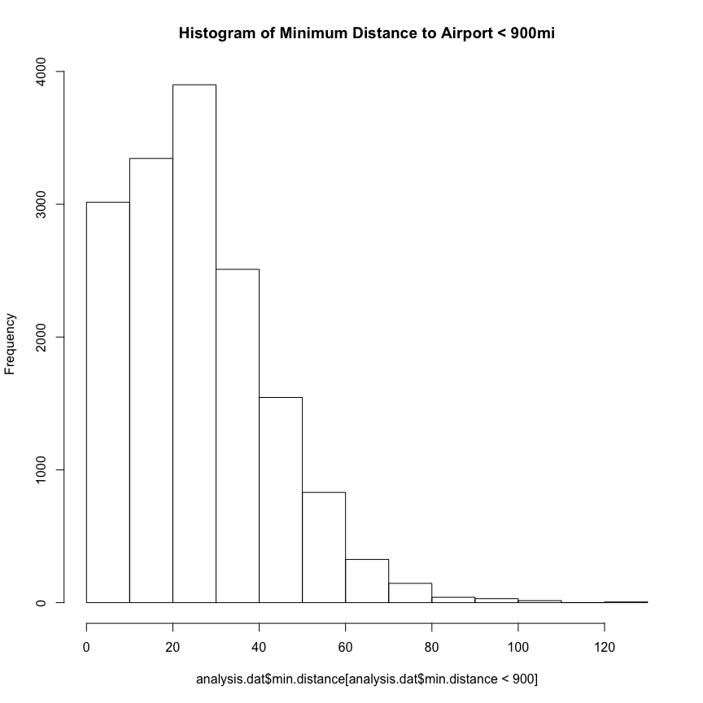<!-- -->

## Correlations

```r
pairs(analysis.dat[c("year", "UE", "min.distance", "enplanements", 
                     "airport.in.cnty")])
```

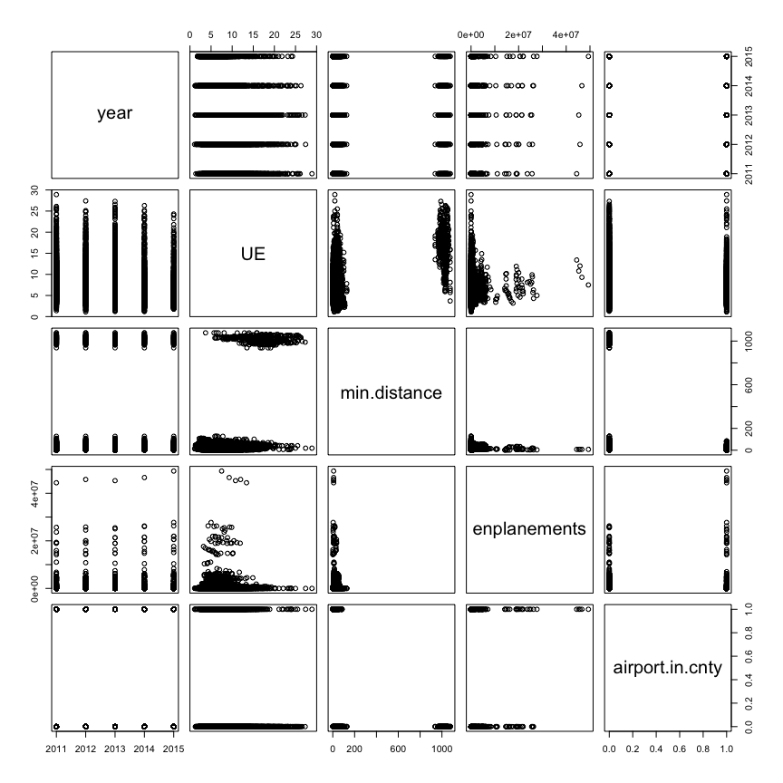<!-- -->

```r
ggplot(analysis.dat) +
  aes(x = UE, y = log10(enplanements)) +
  geom_point() +
  xlab("UE") + ylab("log10(enplanements)")
```

```
## Warning: Removed 5391 rows containing missing values (geom_point).
```

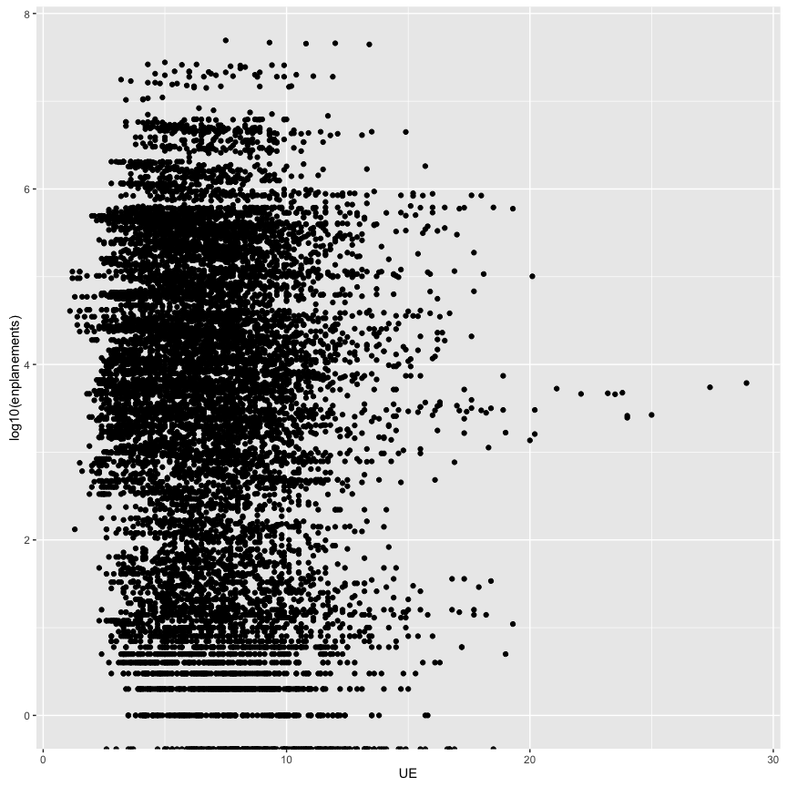<!-- -->

```r
ggplot(analysis.dat) +
  aes(x = UE, y = min.distance) +
  geom_point() +
  xlab("UE") + ylab("min.distance")
```

```
## Warning: Removed 40 rows containing missing values (geom_point).
```

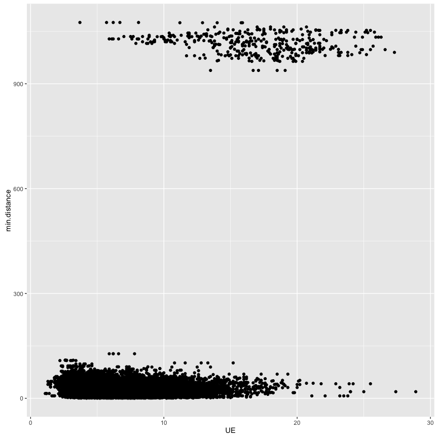<!-- -->

```r
ggplot(analysis.dat) +
  aes(x = UE, y = airport.in.cnty) +
  geom_point() +
  xlab("UE") + ylab("airport.in.cnty")
```

```
## Warning: Removed 40 rows containing missing values (geom_point).
```

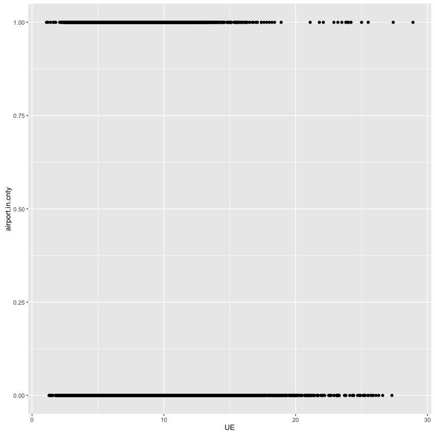<!-- -->


```r
cor.test(analysis.dat$UE, analysis.dat$min.distance)
```

```
## 
## 	Pearson's product-moment correlation
## 
## data:  analysis.dat$UE and analysis.dat$min.distance
## t = 63.535, df = 16093, p-value < 2.2e-16
## alternative hypothesis: true correlation is not equal to 0
## 95 percent confidence interval:
##  0.4353730 0.4600766
## sample estimates:
##       cor 
## 0.4478103
```

```r
cor.test(analysis.dat$UE, analysis.dat$enplanements)
```

```
## 
## 	Pearson's product-moment correlation
## 
## data:  analysis.dat$UE and analysis.dat$enplanements
## t = 0.8028, df = 10742, p-value = 0.4221
## alternative hypothesis: true correlation is not equal to 0
## 95 percent confidence interval:
##  -0.01116538  0.02665083
## sample estimates:
##         cor 
## 0.007745495
```

## Q-Q plots


```r
qqnorm(analysis.dat$UE)
qqline(analysis.dat$UE)
```

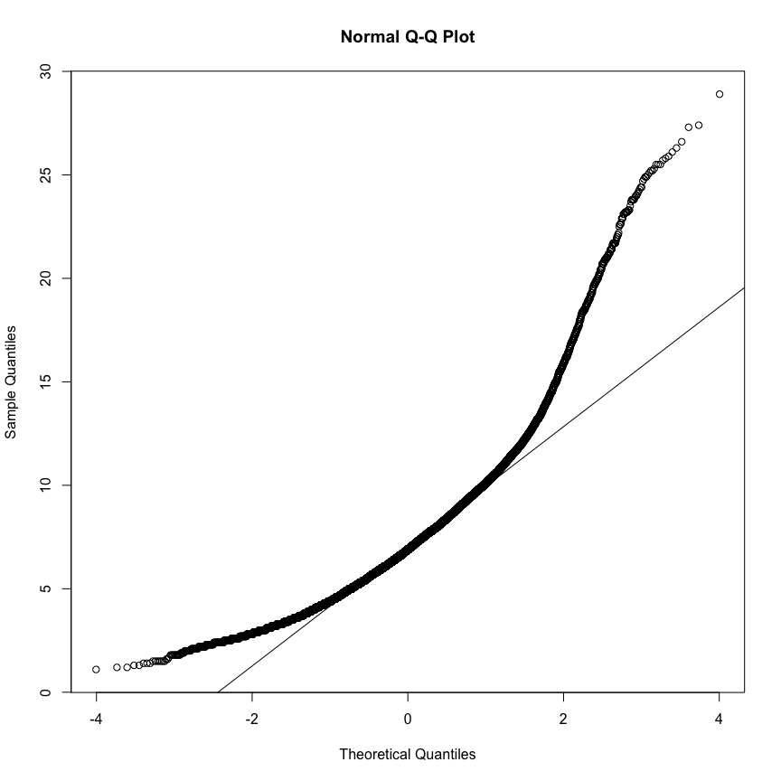<!-- -->


```r
qqnorm(analysis.dat$min.distance)
qqline(analysis.dat$min.distance)
```

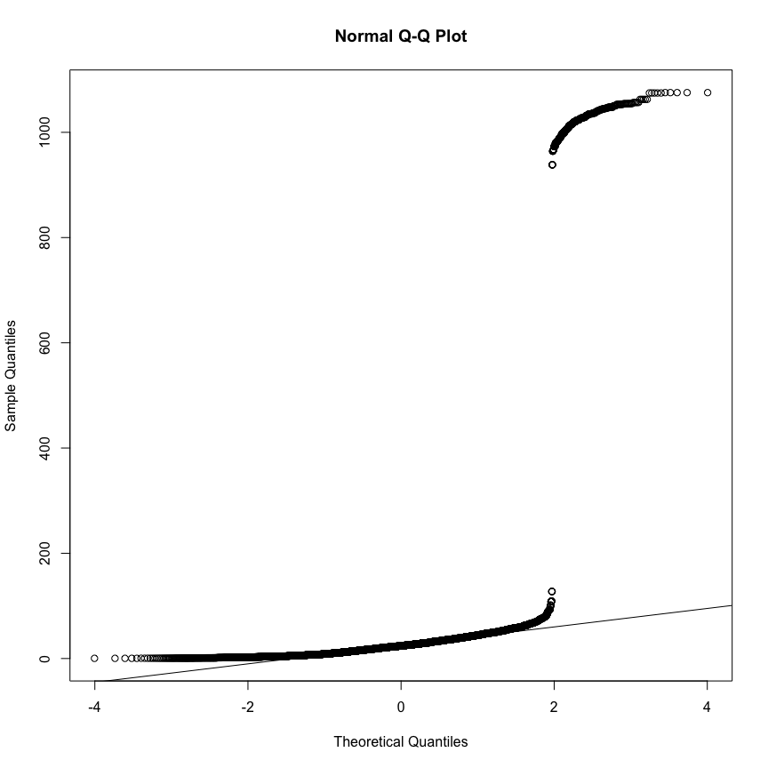<!-- -->


```r
qqnorm(analysis.dat$enplanements)
qqline(analysis.dat$enplanements)
```

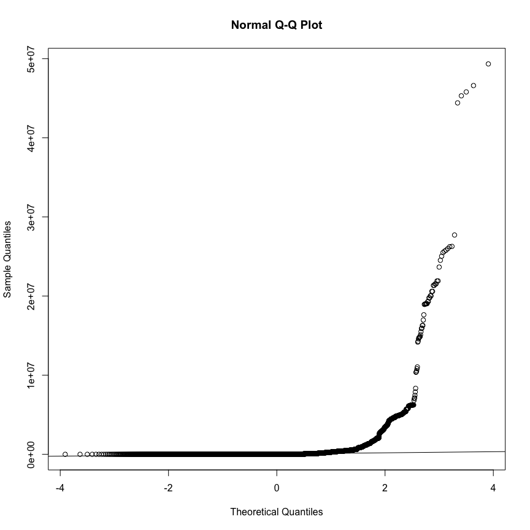<!-- -->

# Relationship between distance to airport and unemployment rate

After some examination, I have chosen to model the outcome as `log(UE)`.

## Creating the Model

```r
model <- lm(log(UE) ~ min.distance + enplanements + airport.in.cnty,
            data = analysis.dat)
```

## Analyzing the Model

```r
model
```

```
## 
## Call:
## lm(formula = log(UE) ~ min.distance + enplanements + airport.in.cnty, 
##     data = analysis.dat)
## 
## Coefficients:
##     (Intercept)     min.distance     enplanements  airport.in.cnty  
##       2.006e+00       -4.729e-03        1.335e-09       -6.165e-02
```

```r
summary(model)
```

```
## 
## Call:
## lm(formula = log(UE) ~ min.distance + enplanements + airport.in.cnty, 
##     data = analysis.dat)
## 
## Residuals:
##      Min       1Q   Median       3Q      Max 
## -1.78482 -0.27493  0.02003  0.28678  1.50819 
## 
## Coefficients:
##                   Estimate Std. Error t value Pr(>|t|)    
## (Intercept)      2.006e+00  1.040e-02 192.864  < 2e-16 ***
## min.distance    -4.729e-03  2.799e-04 -16.898  < 2e-16 ***
## enplanements     1.335e-09  2.176e-09   0.613     0.54    
## airport.in.cnty -6.165e-02  1.097e-02  -5.618 1.97e-08 ***
## ---
## Signif. codes:  0 '***' 0.001 '**' 0.01 '*' 0.05 '.' 0.1 ' ' 1
## 
## Residual standard error: 0.4044 on 10740 degrees of freedom
##   (5391 observations deleted due to missingness)
## Multiple R-squared:  0.02843,	Adjusted R-squared:  0.02816 
## F-statistic: 104.8 on 3 and 10740 DF,  p-value: < 2.2e-16
```

```r
anova(model)
```

```
##                    Df       Sum Sq     Mean Sq    F value       Pr(>F)
## min.distance        1 4.617032e+01 46.17031760 282.249644 1.522321e-62
## enplanements        1 7.726835e-02  0.07726835   0.472359 4.919188e-01
## airport.in.cnty     1 5.163685e+00  5.16368479  31.566779 1.974971e-08
## Residuals       10740 1.756846e+03  0.16357972         NA           NA
```

```r
layout(matrix(c(1,2,3,4),2,2))
plot(model)
```

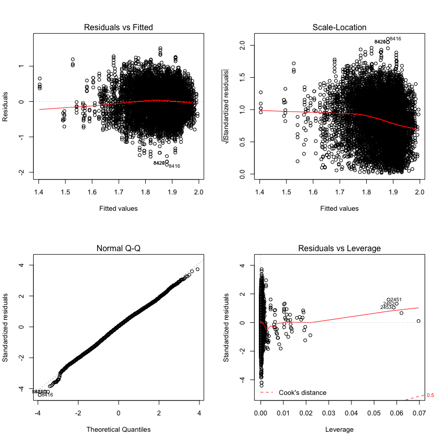<!-- -->

As you can see from the plots, the residuals are approximately normal, which is the desire of linear regression.

# Conclusions
After reviewing the model, there are three outcomes that stand out.

1. Minimum Distance to an airport has a significant effect on the UE rate.

2. Having an airport in the county has a significant effect on the UE rate.

Both variables have a negative influence on Unemployment Rate, which means that having an airport close will slightly reduce the UE rate of the associated counties.

However, it is important to note that the adjusted R^2 of the model is very low. This indicates that while significant, the significance is likely due to the number of observations in the dataset. 

Overall, I would not expect airports to have a huge impact on unemployment rates. There are other variables that explain much more of the variance between Unemployment Rates.

# Future Directions

If I were to take this study further, I would not focus solely on airports and their relationships to counties and Unemployment. Instead, I would focus on adding in information from many other industries, and not just the aviation industry. 

In addition, I would seriously consider adding in other variables such as gender, racial, and economic information related to the county populations. 

# Computer Environment
The computer used for the analysis was a Late 2013 15" MacBook Pro, with 16 GB 1600 MHz DDR3 RAM and a 2.6 GHz Intel Core i7 Processor.


```r
sessionInfo()
```

```
## R version 3.3.1 (2016-06-21)
## Platform: x86_64-apple-darwin15.6.0 (64-bit)
## Running under: OS X 10.11.6 (El Capitan)
## 
## locale:
## [1] en_US.UTF-8/en_US.UTF-8/en_US.UTF-8/C/en_US.UTF-8/en_US.UTF-8
## 
## attached base packages:
## [1] stats     graphics  grDevices utils     datasets  methods   base     
## 
## other attached packages:
##  [1] geosphere_1.5-5    GISTools_0.7-4     rgeos_0.3-19      
##  [4] MASS_7.3-45        RColorBrewer_1.1-2 maptools_0.8-39   
##  [7] rgdal_1.1-10       sp_1.2-3           ggplot2_2.1.0     
## [10] stringr_1.0.0      magrittr_1.5       dplyr_0.5.0       
## [13] openxlsx_3.0.0    
## 
## loaded via a namespace (and not attached):
##  [1] Rcpp_0.12.6      knitr_1.13       munsell_0.4.3    colorspace_1.2-6
##  [5] lattice_0.20-33  R6_2.1.2         plyr_1.8.4       tools_3.3.1     
##  [9] grid_3.3.1       gtable_0.2.0     DBI_0.4-1        htmltools_0.3.5 
## [13] yaml_2.1.13      assertthat_0.1   digest_0.6.9     tibble_1.1      
## [17] formatR_1.4      evaluate_0.9     rmarkdown_1.0.2  labeling_0.3    
## [21] stringi_1.1.1    scales_0.4.0     foreign_0.8-66
```

# Appendices
This section will show the full code of the analysis scripts.

## Appendix A: Complete Analysis

```r
## ----setup, include=FALSE------------------------------------------------
knitr::opts_chunk$set(fig.width = 9, fig.height = 9, fig.path = "figures/")

## ----directorySetup------------------------------------------------------
# Main directory
main.dir <- "~/spatial-analysis-in-r/"

# Script directory
script.dir <- paste0(main.dir, "scripts/")

# data directory
dat.dir <- paste0(main.dir, "data/")

## ----loadPackages, warning = FALSE, error = FALSE, message = FALSE-------
# data import
library(openxlsx)

# data cleaning
library(dplyr)
library(magrittr)
library(stringr)

# general plotting
library(ggplot2)

# mapping
library(sp)
library(rgdal)
library(GISTools)

# distance calculation
library(geosphere)

## ----blsDataPrep1--------------------------------------------------------
# Import UE Data
fname <- paste0(dat.dir, "/bls/la.data.64.County")
bls.dat <- read.delim(fname, header = TRUE, stringsAsFactors = FALSE, 
                      sep = "\t")

# trim white space in series_id
bls.dat$series_id <- trimws(bls.dat$series_id)

# change value to numeric
bls.dat$value <- as.numeric(bls.dat$value)

head(bls.dat)

## ----blsDataPrep2--------------------------------------------------------
# Import la.measure
fname <- paste0(dat.dir, "/bls/la.measure")
bls.measure <- read.delim(fname, header = TRUE, stringsAsFactors = FALSE, 
                      sep = "\t")

## ----blsDataPrep3--------------------------------------------------------
# fix variables
bls.measure$measure_text <- bls.measure$measure_code
bls.measure$measure_code <- as.numeric(rownames(bls.measure))

bls.measure

## ----blsDataPrep4--------------------------------------------------------
# la.period
fname <- paste0(dat.dir, "/bls/la.period")
bls.period <- read.delim(fname, header = TRUE, stringsAsFactors = FALSE, 
                      sep = "\t")

bls.period

## ----blsDataPrep6--------------------------------------------------------
# la.period
fname <- paste0(dat.dir, "/bls/la.series")
bls.series <- read.table(fname, header = TRUE, stringsAsFactors = FALSE, 
                      sep = "\t")

# trim white space from series_id
bls.series$series_id <- trimws(bls.series$series_id)

head(bls.series)

## ----blsDataPrep7--------------------------------------------------------
# filter for period M13
bls.dat <- bls.dat[bls.dat$period == "M13",]

# filter for year
bls.dat <- bls.dat[bls.dat$year %in% c(2011:2015),]
 
# Join data together via a left join.
bls.dat <- merge(bls.dat, bls.series,
                 by.x = "series_id", by.y = "series_id",
                 all.x = TRUE)

bls.dat <- merge(bls.dat, bls.measure,
                 by.x = "measure_code", by.y = "measure_code", all.x = TRUE)

# filter for unemployment rate
bls.dat <- bls.dat[bls.dat$measure_text == "unemployment rate", ]

# reduce dataset
bls.dat <- bls.dat[, c("series_id", "year", "value", 
                       "series_title", "measure_text")]

# Create county name and state variables for easier identification
str.pattern <- "[A-za-z.//]*\\s*[A-za-z.//]*\\s*[A-Za-z.//]*,"

bls.dat$county <- str_extract(bls.dat$series_title, str.pattern)

bls.dat$county <- trimws(gsub(",", "", bls.dat$county))

bls.dat$state <-  str_extract(bls.dat$series_title, "[A-Z]{2}")

# Extract FIPS Code
bls.dat$FIPS <- substr(bls.dat$series_id, 6, 10)

# Select columns
bls <- bls.dat[c("FIPS", "county", "state", "year", "value")]

# Change names
names(bls) <- c("FIPS", "county", "state", "year", "UE")

## ----blsDataPrep8--------------------------------------------------------
head(bls)
summary(bls)

## ----airportPrep---------------------------------------------------------
fname <- paste0(dat.dir, "airports/airports.dat.txt")
airports <- read.csv(fname, header = TRUE, stringsAsFactors = FALSE)

summary(airports)
head(airports)

## ----faaPrep-------------------------------------------------------------
fname <- paste0(dat.dir, "faa/CY12AllEnplanements.xlsx")
faa.cy12 <- openxlsx::read.xlsx(fname)

fname <- paste0(dat.dir, "faa/cy13-all-enplanements.xlsx")
faa.cy13 <- openxlsx::read.xlsx(fname)

fname <- paste0(dat.dir, "faa/CY14-all-enplanements.xlsx")
faa.cy14 <- openxlsx::read.xlsx(fname, sheet = "data")

fname <- paste0(dat.dir, "faa/preliminary-cy15-all-enplanements.xlsx")
faa.cy15 <- openxlsx::read.xlsx(fname)

# Select Annual Data, Rename columns, and add year.
faa.cy11 <- faa.cy12[, c("ST", "Locid", "City", "Airport.Name", 
                         "CY.11.Enplanements")]
names(faa.cy11) <- c("state", "id", "city", "airport.name", "enplanements")
faa.cy11$year <- 2011

faa.cy12 <- faa.cy12[, c("ST", "Locid", "City", "Airport.Name", 
                         "CY.12.Enplanements")]
names(faa.cy12) <- c("state", "id", "city", "airport.name", "enplanements")
faa.cy12$year <- 2012

faa.cy13 <- faa.cy13[, c("ST", "Locid", "City", "Airport.Name",
                         "CY.13.Enplanements")]
names(faa.cy13) <- c("state", "id", "city", "airport.name", "enplanements")
faa.cy13$year <- 2013

faa.cy14 <- faa.cy14[, c("ST", "Locid", "City", "Airport.Name",
                         "CY.14.Enplanements")]
names(faa.cy14) <- c("state", "id", "city", "airport.name", "enplanements")
faa.cy14$year <- 2014

faa.cy15 <- faa.cy15[, c("ST", "Locid", "City", "Airport.Name",
                         "CY.15.Enplanements")]
names(faa.cy15) <- c("state", "id", "city", "airport.name", "enplanements")
faa.cy15$year <- 2015

# Combine
faa <- rbind(faa.cy11, faa.cy12, faa.cy13, faa.cy14, faa.cy15)

summary(faa)
head(faa)

## ----shapefileImport-----------------------------------------------------
dsn <- "/Users/Robby/spatial-analysis-in-r/data/census/"
layer <- "tl_2015_us_county"
county <- rgdal::readOGR(dsn = dsn, layer = layer)

## ----plotLimitsCONUS-----------------------------------------------------
# Continental US (CONUS)
conus.min.lat <- 25
conus.max.lat <- 50
conus.min.long <- -126
conus.max.long <- -65

conus.long.limits <- c(conus.min.long, conus.max.long)
conus.lat.limits <- c(conus.min.lat, conus.max.lat)

## ----plotLimitsHawaii----------------------------------------------------
# Hawaii
hawaii.min.lat <- 18
hawaii.max.lat <- 23
hawaii.min.long <- -161 
hawaii.max.long <- -154

hawaii.long.limits <- c(hawaii.min.long, hawaii.max.long)
hawaii.lat.limits <- c(hawaii.min.lat, hawaii.max.lat)

## ----plotLimitsAlaska----------------------------------------------------
# Alaska
alaska.min.lat <- 52
alaska.max.lat <- 72
alaska.min.long <- -177
alaska.max.long <- -129

alaska.long.limits <- c(alaska.min.long, alaska.max.long)
alaska.lat.limits <- c(alaska.min.lat, alaska.max.lat)

## ----countyAirportIdentification1----------------------------------------
# filter airport coordinates based on FAA codes in faa.data
airports <- airports[airports$country == "United States",]

#filter for CONUS, AK, and HI airports for plotting purposes-only
airports2 <- 
  airports[(between(airports$latitude, conus.min.lat, conus.max.lat) &
           between(airports$longitude, conus.min.long, conus.max.long)) |
           (between(airports$latitude, hawaii.min.lat, hawaii.max.lat) &
           between(airports$longitude, hawaii.min.long, hawaii.max.long)) |
           (between(airports$latitude, alaska.min.lat, alaska.max.lat) &
           between(airports$longitude, alaska.min.long, alaska.max.long)),]

# Prep airport coordinates
coordinates(airports) <- c("longitude", "latitude")
proj4string(airports) <- proj4string(county)

coordinates(airports2) <- c("longitude", "latitude")
proj4string(airports2) <- proj4string(county)

# Set layout for image.
layout(matrix(c(1,1,1,1,
                1,1,1,1,
                2,2,3,3,
                2,2,3,3), ncol = 4, nrow = 4, byrow = TRUE),
       respect = TRUE)

# CONUS Plot (Plot 1)
plot(county, xlim = conus.long.limits, ylim = conus.lat.limits,
     main = "Plot of Airports and Counties", border = "grey",
     lwd = 0.25)
points(airports2, xlim = conus.long.limits, ylim = conus.lat.limits,
       pch = 20, cex = 0.5)

# Hawaii Plot (Plot 2)
plot(county, xlim = hawaii.long.limits, ylim = hawaii.lat.limits,
     border = "grey", lwd = 0.25)
points(airports2, xlim = hawaii.long.limits, ylim = hawaii.lat.limits,
       pch = 20)

# Alaska Plot (Plot 3)
plot(county, xlim = alaska.long.limits, ylim = alaska.lat.limits,
     border = "grey", lwd = 0.25)
points(airports2, xlim = alaska.long.limits, ylim = alaska.lat.limits,
       pch = 20)

## ----countyAirportIdentification2----------------------------------------
# get county ID
airports$county.id <- 
  sp::over(airports, county)$GEOID

# look at results
head(airports)

## ----distCalc------------------------------------------------------------
# Set up output data frame
apt.dist.dat <- data.frame(county.id = county$GEOID,
                           stringsAsFactors = F)

# Calculate distance between each airport
# NOTE: Consider building function instead of looping.
for (apt in airports$airport.id) {
  # The id is created such that the numbers will not make R think it is
  # creating column number XXX vice just adding a new column.
  apt.id <- paste0("airport.", apt)
  
  # get coordinates for airports and counties
  apt.coords <- coordinates(airports)[airports$airport.id == apt,]
  county.coords <- coordinates(county)
  
  # calculate distance
  apt.dist.dat[, apt.id] <- distHaversine(apt.coords, county.coords)
}

## ----distCalcMin---------------------------------------------------------

# This function will return the minimum distance.
min.dist.fn <- function(temp) {

  # Select airport with smallest distance
  min.index <- which.min(temp)
  
  # Return distance
  min.dist <- temp[min.index]
  
  # Get airport ID
  apt.id <- names(temp)[min.index]
  
  # output data
  out <- cbind(min.dist, apt.id)
  return(out)
}

# Get counties
counties <- apt.dist.dat$county.id
# Get minimum distance
min.dist <- apply(apt.dist.dat[,-1], MARGIN = 1, FUN = min.dist.fn)

# transpose and convert from list
min.dist <- t(unlist(min.dist))

# create data frame
min.dist <- data.frame(min.dist, stringsAsFactors = F)

# give column names
names(min.dist) <- c("min.distance", "airport.id")

# convert min.dist to miles
min.dist$min.distance <- as.numeric(min.dist$min.distance)/1609.34

# Get airport ID number
min.dist$airport.id <- gsub("airport.", "", min.dist$airport.id)

# create final distance data set.
cnty.dist <- cbind(counties, min.dist)

cnty.dist$counties <- as.character(cnty.dist$counties)
# look at resulting data set
summary(cnty.dist)
head(cnty.dist)

## ----distPlot------------------------------------------------------------
# Set layout for image.
layout(matrix(c(1,1,1,1,
                1,1,1,1,
                2,2,3,3,
                2,2,3,3), ncol = 4, nrow = 4, byrow = TRUE),
       respect = TRUE)

# create plot dat
plt.dat <- cnty.dist[order(cnty.dist$counties),]

# Create shading
shading <- GISTools::auto.shading(plt.dat$min.distance, n = 5, cols = brewer.pal(5, "Blues"))

# CONUS Plot (Plot 1)
choropleth(county, plt.dat$min.distance, shading = shading,
           xlim = conus.long.limits, ylim = conus.lat.limits,
           main = "Plot of Min Distance to Airport", border = NA)
# add legend
choro.legend(px = -125, py = 31, sh = shading)

# Hawaii Plot (Plot 2)
choropleth(county, plt.dat$min.distance, shading = shading,
     xlim = hawaii.long.limits, ylim = hawaii.lat.limits,
     border = NA)

# Alaska Plot (Plot 3)
choropleth(county, plt.dat$min.distance, shading = shading,
     xlim = alaska.long.limits, ylim = alaska.lat.limits,
     border = NA)


## ----finalAnalysisData---------------------------------------------------
# join BLS data and cnty.dist dat
analysis.dat <- merge(bls, cnty.dist,
                      by.x = "FIPS", by.y = "counties", 
                      all.x = TRUE)

# join airports with analysis.dat
analysis.dat <- merge(analysis.dat, 
                      airports[, c("airport.id", "iata.faa.code", "county.id")],
                      by.x = "airport.id", by.y = "airport.id", all.x = TRUE)

# join with faa data
analysis.dat <- merge(analysis.dat, faa[, c("id", "year", "enplanements")],
                      by.x = c("iata.faa.code", "year"),
                      by.y = c("id", "year"), all.x = TRUE)

# determine if airport located within county
analysis.dat$airport.in.cnty <- 
    ifelse(analysis.dat$FIPS == analysis.dat$county.id, 1, 0)


# select and reorder remaining variables
vars <- c("FIPS", "county", "state", "year", "UE", "min.distance", 
          "enplanements", "airport.in.cnty")

analysis.dat <- analysis.dat[, vars]

# look at data
dim(analysis.dat)
summary(analysis.dat)
head(analysis.dat)

# show complete cases
dim(analysis.dat[complete.cases(analysis.dat),])
summary(analysis.dat[complete.cases(analysis.dat),])
head(analysis.dat[complete.cases(analysis.dat),])


## ----EDA1----------------------------------------------------------------
# Unemployment Data
ggplot(analysis.dat[!is.na(analysis.dat$year),]) +
  aes(year, UE, group = year) +
  geom_boxplot() +
  xlab("Year") + ylab("Unemployment") +
  ggtitle("Unemployment by Year")

## ----EDA2----------------------------------------------------------------

ggplot(analysis.dat) +
  aes(year, enplanements, group = year) +
  geom_boxplot() +
  xlab("Year") + ylab("Enplanements") +
  ggtitle("Enplanements by Year")

## ----EDA3----------------------------------------------------------------
ggplot(analysis.dat[analysis.dat$enplanements < 250000,]) +
  aes(year, enplanements, group = year) +
  geom_boxplot() +
  xlab("Year") + ylab("Enplanements") +
  ggtitle("Enplanements by Year")


## ----EDA4----------------------------------------------------------------
ggplot(analysis.dat) +
  aes(year, min.distance, group = year) +
  geom_boxplot() +
  xlab("Year") + ylab("Minimum Distance (mi)") +
  ggtitle("Minimum Distance to Nearest Airport by Year")

ggplot(analysis.dat[analysis.dat$min.distance < 900,]) +
  aes(year, min.distance, group = year) +
  geom_boxplot() +
  xlab("Year") + ylab("Minimum Distance (mi)") +
  ggtitle("Minimum Distance to Nearest Airport by Year")

hist(analysis.dat$min.distance, 
     main = "Histogram of Minimum Distance")

hist(analysis.dat$min.distance[analysis.dat$min.distance < 900],
     main = "Histogram of Minimum Distance to Airport < 900mi")


## ----EDA_pairs-----------------------------------------------------------
pairs(analysis.dat[c("year", "UE", "min.distance", "enplanements", 
                     "airport.in.cnty")])

ggplot(analysis.dat) +
  aes(x = UE, y = log10(enplanements)) +
  geom_point() +
  xlab("UE") + ylab("log10(enplanements)")

ggplot(analysis.dat) +
  aes(x = UE, y = min.distance) +
  geom_point() +
  xlab("UE") + ylab("min.distance")
  
ggplot(analysis.dat) +
  aes(x = UE, y = airport.in.cnty) +
  geom_point() +
  xlab("UE") + ylab("airport.in.cnty")


## ----EDA_corrs-----------------------------------------------------------
cor.test(analysis.dat$UE, analysis.dat$min.distance)

cor.test(analysis.dat$UE, analysis.dat$enplanements)


## ----qqplots1------------------------------------------------------------
qqnorm(analysis.dat$UE)
qqline(analysis.dat$UE)

## ----qqplots2------------------------------------------------------------
qqnorm(analysis.dat$min.distance)
qqline(analysis.dat$min.distance)

## ----qqplots3------------------------------------------------------------
qqnorm(analysis.dat$enplanements)
qqline(analysis.dat$enplanements)

## ----model---------------------------------------------------------------

model <- lm(log(UE) ~ min.distance + enplanements + airport.in.cnty,
            data = analysis.dat)


## ----model_summary-------------------------------------------------------
model
summary(model)
anova(model)

layout(matrix(c(1,2,3,4),2,2))
plot(model)

## ----computerInfo--------------------------------------------------------
sessionInfo()
```

## Appendix B: Airport Location from openflight.org

```r
# File url
file <- "https://raw.githubusercontent.com/jpatokal/openflights/master/data/airports.dat"

# destination
dest <- "~/spatial-analysis-in-r/data/airports/airports.dat.txt"

# download file
download.file(file, dest)

# Check downloaded file
airports <- read.csv(dest, header = FALSE)

# name columns
names(airports) <- c("airport.id", "name", "city", "country", "iata.faa.code",
                     "icao.code", "latitude", "longitude", "altitude",
                     "UTC.offset", "DST", "time.zone.olson")

# save file with column names
  write.csv(airports, dest, row.names = FALSE)
```

## Appendix C: County Shapefile from Census Bureau

```r
# County shapefile url
url <- "ftp://ftp2.census.gov/geo/tiger/TIGER2015/COUNTY/tl_2015_us_county.zip"

# path
path <- "~/spatial-analysis-in-r/data/census/"

# destination
dest <- paste0(path, "tl_2015_us_county.zip")

# download file
download.file(url, dest)

# unzip file
unzip(dest, exdir = path, junkpaths = TRUE)
```

## Appendix D: BLS Data

```r
# Set main part of url for downloading the files
main.url <- "http://download.bls.gov/pub/time.series/la/"

# Set main directory for download
download.dir <- "~/spatial-analysis-in-r/data/bls/"

# List of files to download
file.list <- c("la.area", "la.area_type", "la.data.64.County", "la.measure",
               "la.period", "la.series", "la.state_region_division")

# combine download urls
download.urls <- unlist(lapply(main.url, FUN = "paste0", file.list))

# combine for file locations
download.locations <- unlist(lapply(download.dir, FUN = "paste0", file.list))

# download files
for (file in 1:length(file.list)) {
  if (!(file.list[file] %in% dir(download.dir))) {
    download.file(url = download.urls[file], destfile = download.locations[file])
  }
}
```
